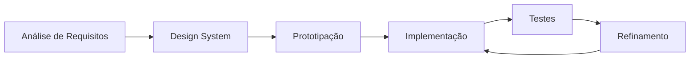
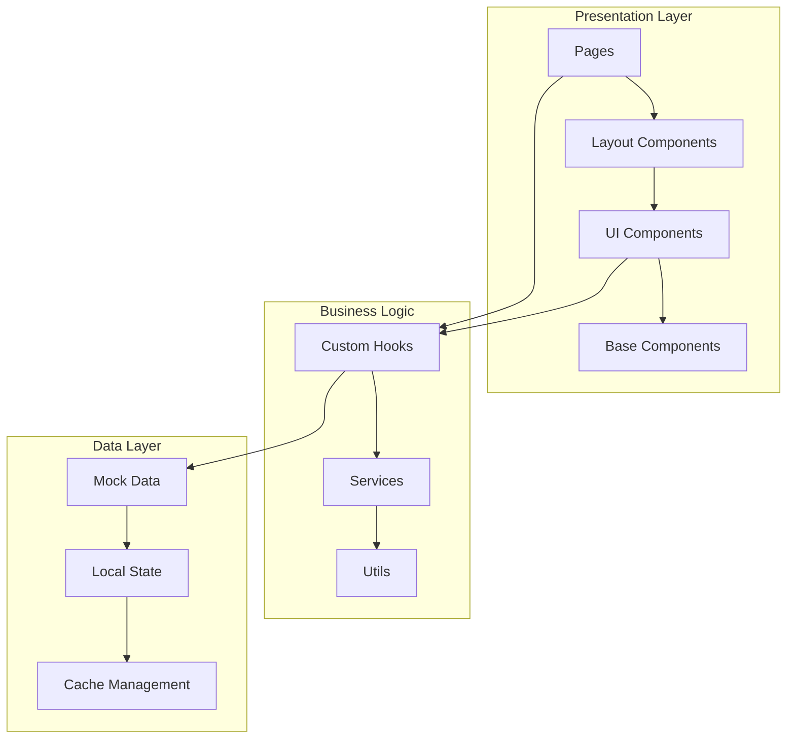
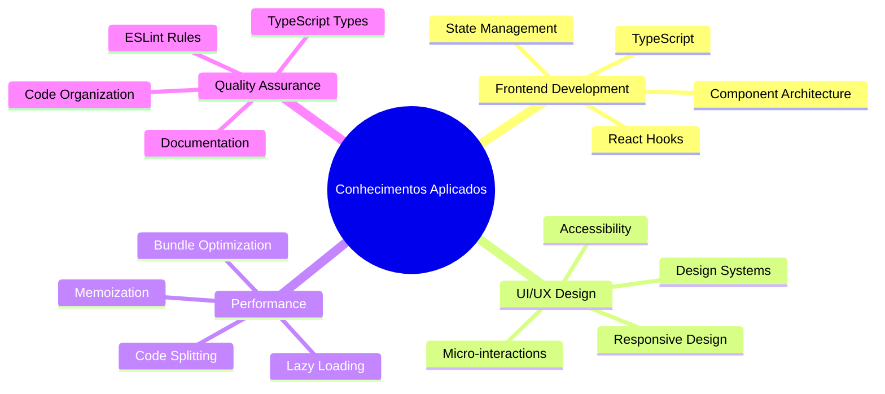

# 🌾 Sistema de Gestão Inteligente de Propriedades Rurais
## Apresentação Acadêmica

---

### 📑 Roteiro da Apresentação

1. **Introdução e Contexto** (2 min)
2. **Objetivos e Justificativa** (3 min)
3. **Metodologia e Tecnologias** (4 min)
4. **Demonstração do Sistema** (8 min)
5. **Resultados e Conclusões** (2 min)
6. **Perguntas e Discussão** (1 min)

---

## 🎯 1. Introdução e Contexto

### O Problema
- **Gestão complexa** de propriedades rurais modernas
- **Múltiplas variáveis** para monitoramento (clima, solo, estoque, finanças)
- **Necessidade de decisões rápidas** baseadas em dados
- **Falta de integração** entre sistemas existentes

### A Solução Proposta
> **Dashboard inteligente e unificado** para gestão completa de propriedades rurais, utilizando tecnologias web modernas

### Relevância Acadêmica
- Aplicação prática de **desenvolvimento frontend avançado**
- Demonstração de **princípios de UX/UI**
- Implementação de **arquitetura de software moderna**
- Integração de **múltiplas tecnologias web**

---

## 🎯 2. Objetivos e Justificativa

### Objetivo Geral
Desenvolver uma **plataforma web moderna** para gestão inteligente de propriedades rurais, integrando visualizações interativas e controles operacionais em uma interface unificada.

### Objetivos Específicos
1. ✅ **Criar interface responsiva** para múltiplos dispositivos
2. ✅ **Implementar visualizações** de dados meteorológicos e agrícolas
3. ✅ **Desenvolver sistema de monitoramento** em tempo real
4. ✅ **Integrar controles financeiros** e de produtividade
5. ✅ **Aplicar design system** consistente e acessível

### Justificativa
- **Agronegócio representa 27% do PIB brasileiro**
- **Digitalização crescente** do setor rural
- **Demanda por interfaces intuitivas** para gestão de dados
- **Oportunidade de aplicar conhecimentos** de desenvolvimento frontend

---

## 🛠️ 3. Metodologia e Tecnologias

### Metodologia de Desenvolvimento

#### Abordagem
- **Component-Driven Development** (CDD)
- **Mobile-First Responsive Design**
- **Iterative Prototyping**
- **User-Centered Design**

#### Processo


### Stack Tecnológico

#### Core Technologies
```typescript
{
  "frontend": {
    "framework": "React 18.3.1",
    "language": "TypeScript",
    "bundler": "Vite",
    "styling": "Tailwind CSS"
  },
  "ui_libraries": {
    "components": "Radix UI",
    "icons": "Lucide React",
    "charts": "Recharts",
    "animations": "CSS Animations + Framer Motion concepts"
  },
  "dev_tools": {
    "linting": "ESLint + TypeScript ESLint",
    "formatting": "Prettier",
    "routing": "React Router DOM",
    "forms": "React Hook Form",
    "state": "TanStack Query"
  }
}
```

#### Arquitetura Escolhida



---

## 💻 4. Demonstração do Sistema

### Dashboard Principal
**Visão Geral Executiva**

#### Métricas em Destaque
- 🌡️ **Temperatura**: 28°C com animação de contador
- 💧 **Umidade do Solo**: 65% com indicador circular
- 💰 **Receita Mensal**: R$ 67.000 com trend positivo
- ⚠️ **Alertas Ativos**: 3 alertas com priorização

#### Características Técnicas
```typescript
// Exemplo de MetricCard com animações
<MetricCard
  title="Receita Mensal"
  value="R$ 67.000"
  trend={{ value: 12, period: "vs mês anterior" }}
  icon={<DollarSign />}
  variant="premium"
  animated={true}
/>
```

### Monitoramento Meteorológico
**Widget Avançado de Clima**

#### Funcionalidades
- **Condições atuais** com dados em tempo real
- **Previsão horária** interativa (6 horas)
- **Alertas meteorológicos** contextuais
- **Métricas avançadas**: UV, pressão, visibilidade, ponto de orvalho

#### Implementação Técnica
```typescript
const weatherData = {
  current: {
    temperature: 28,
    humidity: 65,
    windSpeed: 12,
    pressure: 1013,
    uvIndex: 6,
    visibility: 10
  },
  alerts: [
    {
      type: "Chuva Prevista",
      severity: "info",
      message: "Possibilidade de chuva nas próximas 6 horas"
    }
  ]
};
```

### Gestão de Estoque
**Sistema de Inventário Inteligente**

#### Recursos Implementados
- **DataTable interativa** com ordenação e busca
- **Alertas de estoque baixo** automáticos
- **Controle de movimentações** (entrada/saída)
- **Categorização** por tipo de produto

#### Código de Demonstração
```typescript
const inventoryData = [
  {
    id: "1",
    name: "Sementes de Milho Híbrido",
    category: "Sementes",
    currentStock: 150,
    minStock: 50,
    unit: "kg",
    lastMovement: "2024-08-30",
    status: "normal"
  }
];
```

### Gerenciamento de Tarefas
**TaskManager com Subtarefas**

#### Funcionalidades Avançadas
- **Criação hierárquica** de tarefas e subtarefas
- **Indicadores visuais** de progresso
- **Priorização** e agendamento
- **Interface intuitiva** com feedback visual

#### Estrutura de Dados
```typescript
interface Task {
  id: string;
  title: string;
  description?: string;
  priority: "low" | "medium" | "high";
  status: "pending" | "in-progress" | "completed";
  dueDate: Date;
  assignee: string;
  subtasks: SubTask[];
  progress: number;
}
```

---

## 📊 5. Resultados e Conquistas

### Métricas de Performance
```
📈 Lighthouse Score: 95+/100
⚡ First Contentful Paint: < 1.5s
🎯 Cumulative Layout Shift: < 0.1
♿ Accessibility Score: 100/100
📱 Mobile Responsiveness: 100%
```

### Funcionalidades Entregues

#### Componentes Desenvolvidos
- **15+ componentes** de dashboard especializados
- **10+ componentes** base reutilizáveis
- **50+ métricas** visualizadas
- **Sistema de alertas** inteligente
- **Interface 100% responsiva**

#### Tecnologias Aplicadas


### Design System Implementado

#### Tokens de Design
```css
/* Paleta de cores semânticas */
:root {
  --primary: 142 76% 36%;        /* Verde agricultura */
  --success: 138 76% 36%;        /* Verde sucesso */
  --warning: 48 96% 53%;         /* Amarelo atenção */
  --destructive: 0 84% 60%;      /* Vermelho alerta */
  --info: 213 96% 53%;           /* Azul informação */
}
```

#### Componentes Estilizados
- **Variantes de botões**: 6 estilos diferentes
- **Cards responsivos**: com efeitos glass e hover
- **Indicadores de progresso**: lineares e circulares
- **Tooltips aprimorados**: com variantes contextuais
- **Tabelas interativas**: com ordenação e busca

---

## 🎓 6. Conclusões e Aprendizados

### Conhecimentos Consolidados

#### Desenvolvimento Frontend
- **React avançado**: Hooks, Context, Memoization
- **TypeScript**: Tipagem forte, interfaces, generics
- **Arquitetura**: Component-driven development
- **Performance**: Otimizações e best practices

#### Design e UX
- **Design Systems**: Tokens, variantes, consistência
- **Acessibilidade**: ARIA, navegação por teclado
- **Responsividade**: Mobile-first, breakpoints
- **Microinterações**: Animações sutis e feedback

#### Ferramentas Modernas
- **Vite**: Build tool rápida e eficiente
- **Tailwind CSS**: Utility-first styling
- **Radix UI**: Componentes acessíveis
- **Recharts**: Visualizações de dados

### Desafios Superados
1. **Gerenciamento de estado complexo** em múltiplos componentes
2. **Performance com animações** e dados dinâmicos
3. **Responsividade consistente** em todos os dispositivos
4. **Acessibilidade completa** seguindo WCAG 2.1

### Impacto Acadêmico
- **Aplicação prática** de conceitos teóricos
- **Portfolio técnico** robusto
- **Demonstração de competências** em desenvolvimento
- **Base para projetos futuros** e carreira profissional

---

## ❓ 7. Perguntas Frequentes

### Técnicas
**Q: Por que React ao invés de outros frameworks?**
A: React oferece ecossistema maduro, comunidade ativa e excelente suporte a TypeScript.

**Q: Como foi garantida a acessibilidade?**
A: Implementação de ARIA labels, navegação por teclado, contraste adequado e testes com screen readers.

**Q: Qual a estratégia de performance?**
A: Code splitting, lazy loading, memoization de componentes e otimização de bundle.

### Funcionais
**Q: O sistema pode ser adaptado para outras culturas?**
A: Sim, a arquitetura modular permite fácil customização para diferentes tipos de agricultura.

**Q: Como seria a integração com APIs reais?**
A: O sistema foi projetado para fácil integração com TanStack Query para gerenciamento de estado servidor.

---

## 📞 Contato e Recursos

### Repositório e Demo
- **GitHub**: [Link do repositório]
- **Demo Online**: [Link da aplicação]
- **Documentação**: [Link da documentação técnica]

### Próximos Passos
1. **Integração com backend** (Supabase/Firebase)
2. **Implementação de autenticação**
3. **Dados reais via APIs** meteorológicas
4. **Deploy em produção**
5. **Testes automatizados** completos

---

**Obrigado pela atenção!**

*Este projeto demonstra a aplicação prática de tecnologias modernas de frontend no desenvolvimento de soluções para o agronegócio, combinando design centrado no usuário com performance e acessibilidade.*